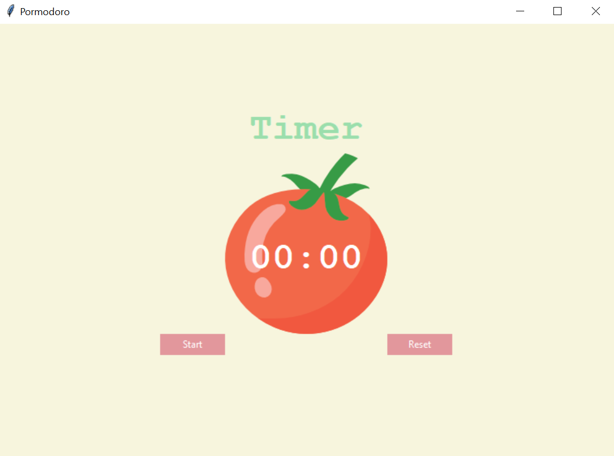
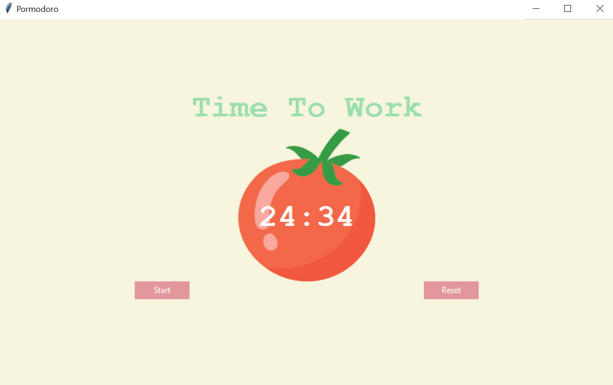

# Promodoro-Technique
The Pomodoro Technique is a time management method developed by Francesco Cirillo in the late 1980s.

The original technique has six steps:

1) Decide on the task to be done.
2) Set the pomodoro timer (25 minutes) Work on the task.
3) take a short break (5 minutes)
4) If you have fewer than three pomodoros, go back to Step 2 and repeat until you go through all three pomodoros.
5) After three pomodoros are done, take the fourth pomodoro and then take a long break (traditionally 20 to 30 minutes). 
6) Once the long break is finished, return to step 2 and start over three pomodoros.

# images 

Homepage screen 

Work on the task screen

